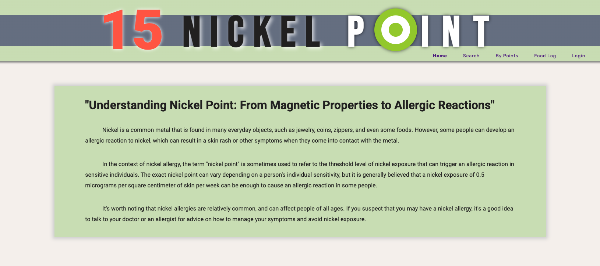
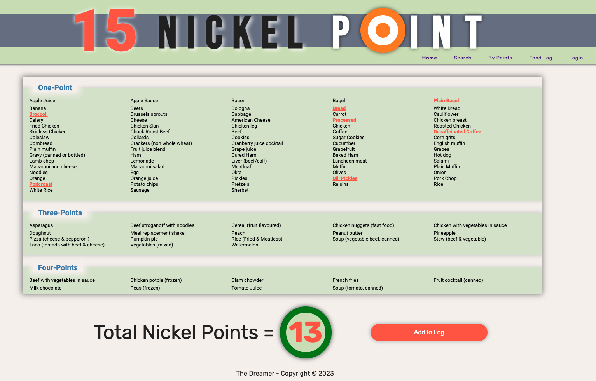
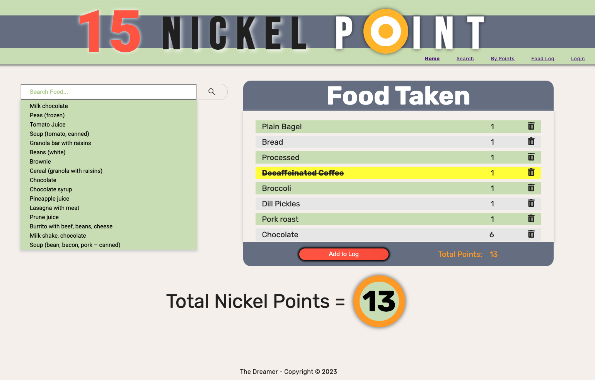
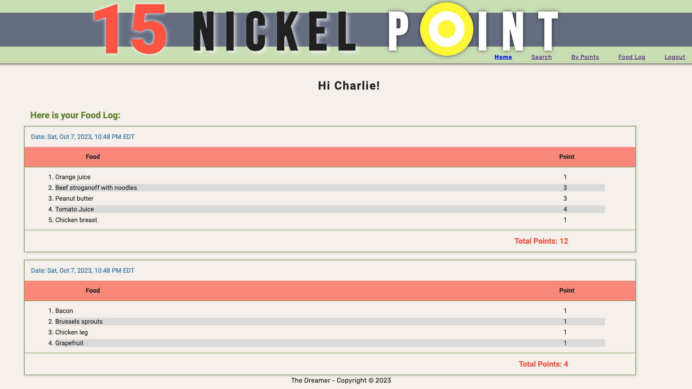
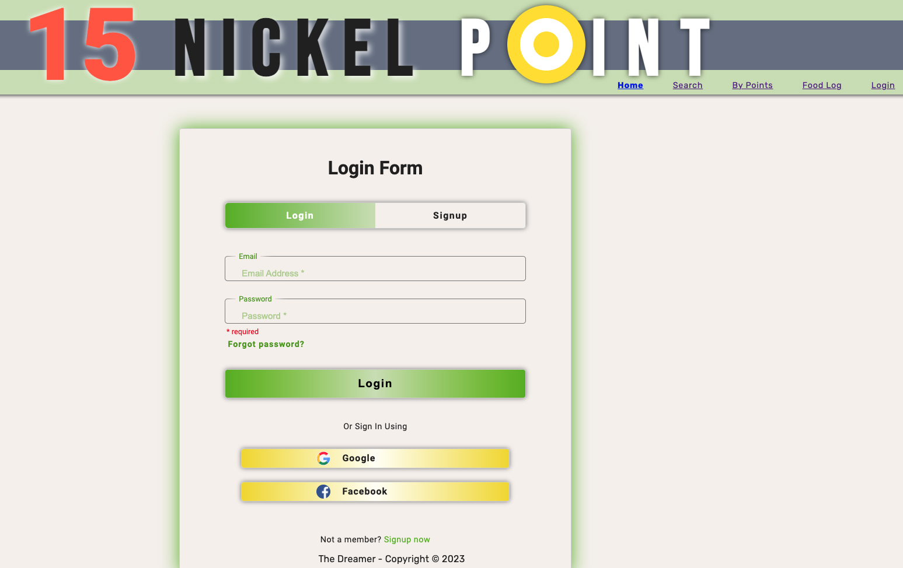
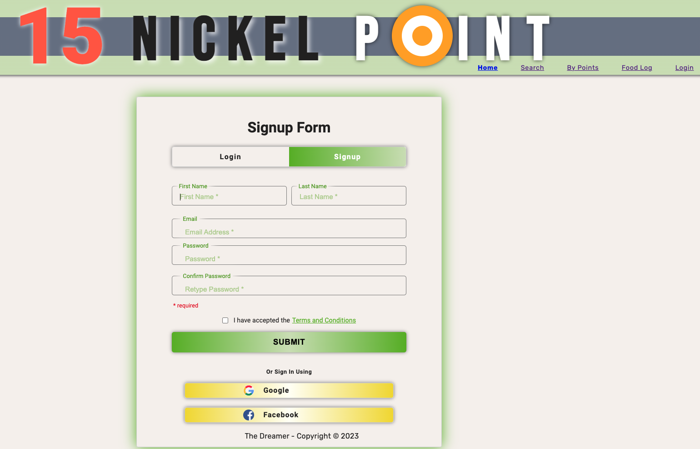

# 15 Nickel Point - Nickel Allergy Management App

## Overview

15 Nickel Point is an interactive app designed to help individuals with nickel allergies manage their condition. The app provides a comprehensive list of foods and their nickel content, allowing users to track their nickel intake in the form of "Nickel Points." The goal is to help users stay within a daily limit of 15 Nickel Points to minimize nickel exposure.

### Why Nickel Allergy Matters

Nickel is a common metal found in everyday objects, such as jewelry, coins, zippers, and certain foods. However, some people can develop allergic reactions to nickel, resulting in skin rashes and other symptoms upon contact with the metal.

In the context of nickel allergy, the term "nickel point" refers to the threshold level of nickel exposure that can trigger an allergic reaction in sensitive individuals. The exact nickel point varies depending on an individual's sensitivity, but it is generally believed that a nickel exposure of 0.5 micrograms per square centimeter of skin per week can be enough to cause a reaction in some people.

It's essential to note that nickel allergies are relatively common and can affect people of all ages. If you suspect you have a nickel allergy, it's advisable to consult a healthcare professional for guidance on managing symptoms and avoiding nickel exposure.

## Features

- Browse an extensive list of foods and their respective nickel point values.

- Log the foods you consume daily to keep a record of your nickel intake.

- Monitor your daily nickel intake and strive to stay below 15 Nickel Points.

## Technologies Used

- HTML
- CSS
- JavaScript
- React

## Usage

1. Clone the repository to your local machine.
2. Run the development server with the following command:

3. Access the application in your web browser by visiting http://localhost:3000.

## Contributing

We welcome contributions to 15 Nickel Point. If you'd like to contribute, please follow these steps:

1. Fork the repository.
2. Create a new branch for your changes.
3. Make your changes and commit them.
4. Push your changes to your forked repository.
5. Submit a pull request with your proposed changes.

We appreciate any enhancements or new features that can benefit individuals with nickel allergies.

## License

This project is licensed under the MIT License.

## Contact

If you have any questions or feedback, please don't hesitate to reach out to us at your-email@example.com.

## Note

This app is still under construction, and some features may not be fully functional, including the authentication login buttons for Google and Facebook. To test the login functionality, you can use the following credentials:

- Email: user@user.com
- Password: user

